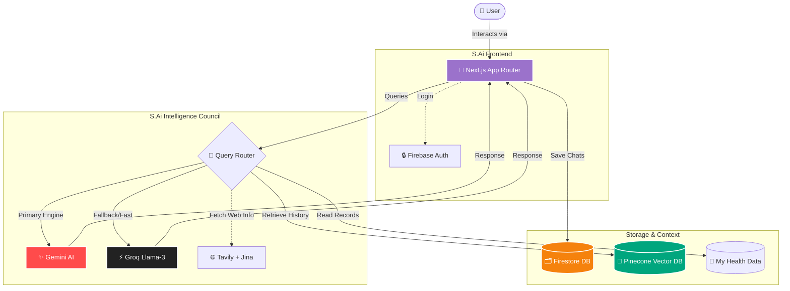

# S.Ai — Personal Health Assistant

**An intelligent, memory-aware AI companion built to care for your health — body and mind.**

---

## 🌟 What is S.Ai?

**S.Ai** is a personal health chatbot designed to feel like a caring, knowledgeable friend. It goes beyond generic advice — it remembers who you are, your health history, and your preferences to give truly personalised responses.

Whether you want to check symptoms, understand a medication, plan your diet, or just talk about how you're feeling, S.Ai is there for you.

> Built with love by a developer, for someone very special.

---

## ✨ Key Features

| Feature | Description |
|---|---|
| 🤖 Intelligent Health Chat | Answers health queries with empathy and medical awareness |
| 🧠 Persistent Memory | Remembers past conversations using vector search |
| 👤 Personal Profile | Stores your name, age, diet, health info for deep personalisation |
| 📎 File Attachments | Upload images, PDFs, DOCX, TXT, CSV as health context |
| 🌐 Real-time Web Search | Fetches up-to-date health info from the web when needed |
| 🗂️ Chat Management | ChatBin, Archived Chats, full session history |
| 🏥 My Health Data | Upload and store health documents & notes as AI context |
| 🌙 Premium Dark UI | Animated gradients, plasma backgrounds, glassmorphism design |
| 📱 Fully Responsive | Optimised for mobile and desktop |
| 🔐 Guest Mode | Try S.Ai without signing in (limited messages) |

---

## 🏗️ Architecture

The AI system uses a **custom system prompt** to shape personality, tone, health expertise, and language behaviour. The prompt's contents are intentionally kept private — no internal instructions, persona rules, or API configurations are exposed publicly.

---

## 🗓️ Release History

### Initial Commit — *June 18, 2026*
- Project inception — a developer built S.Ai for someone very special in his life
- First working prototype with Gemini AI
- Basic chat interface with login and Pinecone memory

### Beta v1.0.0 — *June 30, 2026*
- Stable beta launch with full login & session management
- Multi-model fallback to handle rate limits
- Serverless Vercel deployment
- Firebase Firestore for persistent chat history

### Major Update v2.0 — *September 18, 2026*
- Complete UI overhaul — premium dark design with plasma gradients
- Multi-model LLM Council (Gemini + Groq/Llama-3)
- Local proxy support (ngrok, localtunnel, Cloudflare Tunnel)
- Real-time web search via Tavily + Jina
- Attachment support: images, PDFs, DOCX, TXT, CSV
- ChatBin + Archived Chats
- My Health Data: upload documents & notes to AI context
- Guest mode with smart onboarding
- S.Ai Avatar with speech bubble
- Fully responsive mobile layout

---

## 🛠️ Tech Stack

- **Framework:** Next.js 16 (App Router, Turbopack)
- **UI:** React, Framer Motion, Lucide Icons, Custom CSS
- **AI:** Google Gemini AI SDK, Groq API
- **Database:** Firebase Firestore
- **Auth:** Firebase Authentication (Google Sign-In)
- **Vector Memory:** Pinecone
- **Web Search:** Tavily API, Jina.ai Reader
- **File Parsing:** pdf-parse, mammoth
- **Deployment:** Vercel

---

## 🔒 Privacy & Security

- User health data is stored in Firestore under authenticated user IDs only
- The system prompt and AI configuration details are kept private intentionally
- No internal API keys, model names, or pipeline logic are exposed in the UI
- Guest users have isolated, session-only memory with no persistence

---

## 🔗 Related Projects

- **Healthify** — A companion health tracking app that will integrate with S.Ai (coming soon)

---

Made with ❤️ by a developer, for someone very special.
